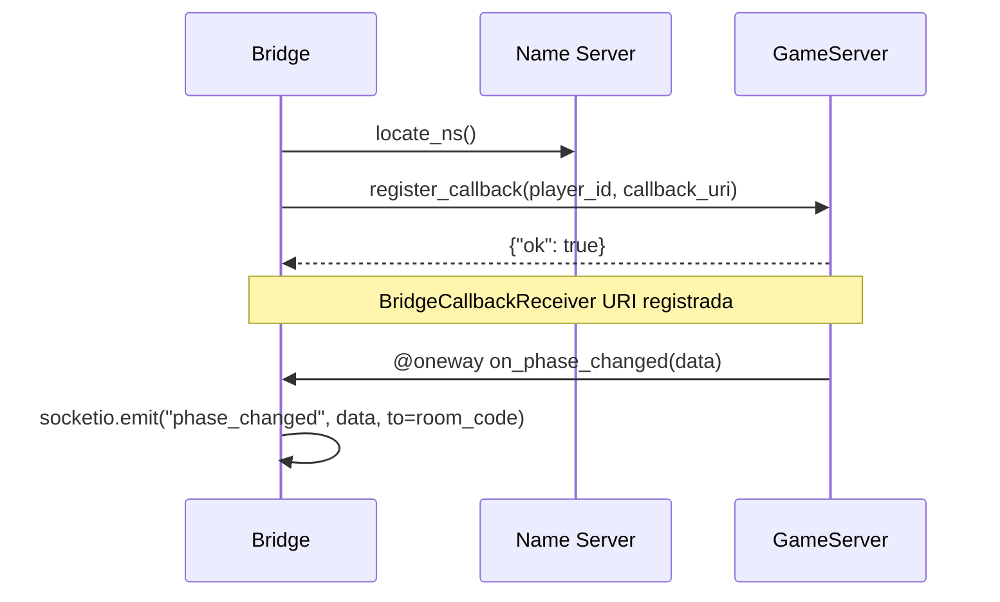

<objective>
Set up the technical report document and build pipeline.

Purpose: Create the complete docs/ scaffold — Makefile, Mermaid diagram sources, and full relatorio.md content — so the academic report can be compiled to PDF by running a single `make -C docs pdf` command. This is the Wave 0 deliverable for all REPORT-XX requirements.

Output: docs/relatorio.md (full content), docs/Makefile, docs/puppeteer-config.json, three .mmd diagram sources, docs/package.json (for @mermaid-js/mermaid-cli dependency).
</objective>

<execution_context>
@/home/spacko/.claude/get-shit-done/workflows/execute-plan.md
@/home/spacko/.claude/get-shit-done/templates/summary.md
</execution_context>

<context>
@.planning/PROJECT.md
@.planning/ROADMAP.md
@.planning/phases/08-ui-polish-technical-report/08-CONTEXT.md
@.planning/phases/08-ui-polish-technical-report/08-RESEARCH.md
@.planning/phases/08-ui-polish-technical-report/08-PATTERNS.md
@CLAUDE.md

<interfaces>
<!-- Key patterns for the report build pipeline. Source: 08-PATTERNS.md §docs/Makefile and §docs/relatorio.md -->

Makefile pattern (from 08-PATTERNS.md):
```makefile
PANDOC   = pandoc
MMDC     = ./node_modules/.bin/mmdc
PUPPETEER_CFG = puppeteer-config.json

.PHONY: pdf diagrams clean

pdf: diagrams relatorio.pdf

diagrams:
	$(MMDC) --puppeteerConfigFile $(PUPPETEER_CFG) -i diagrams/arquitetura.mmd    -o diagrams/arquitetura.png    -b transparent
	$(MMDC) --puppeteerConfigFile $(PUPPETEER_CFG) -i diagrams/seq-callback.mmd   -o diagrams/seq-callback.png   -b transparent
	$(MMDC) --puppeteerConfigFile $(PUPPETEER_CFG) -i diagrams/seq-game-event.mmd -o diagrams/seq-game-event.png -b transparent

relatorio.pdf: relatorio.md diagrams/arquitetura.png diagrams/seq-callback.png diagrams/seq-game-event.png
	$(PANDOC) relatorio.md \
	  -o relatorio.pdf \
	  --pdf-engine=xelatex \
	  -V geometry:margin=2cm \
	  -V fontsize=11pt \
	  -V lang=pt-BR \
	  --highlight-style=tango

clean:
	rm -f relatorio.pdf diagrams/*.png
```

puppeteer-config.json (Pitfall 6 — no-sandbox for Linux headless):
```json
{ "args": ["--no-sandbox", "--disable-setuid-sandbox"] }
```

Architecture Mermaid diagram (from 08-RESEARCH.md):
```mermaid
graph LR
  NS[Name Server\nPyro5 NS]
  GS[GameServer\nPyro5 Daemon]
  BR[Bridge\nFlask-SocketIO]
  FE[Frontend\nReact Browser]

  GS -->|register| NS
  BR -->|lookup game.server| NS
  BR -->|RPC calls| GS
  GS -->|@oneway callback| BR
  FE -->|Socket.IO| BR
  BR -->|Socket.IO events| FE
```

Callback registration sequence (from 08-RESEARCH.md):


pandoc is at /usr/bin/pandoc (version 2.17.1.1), xelatex at /usr/bin/xelatex (TeX Live 2022), Chrome 148 available for mmdc headless rendering.
</interfaces>
</context>

<tasks>

<task type="auto">
  <name>Task 1: Create docs/ scaffold — Makefile, puppeteer-config.json, package.json, and Mermaid diagram sources</name>
  <files>
    docs/Makefile
    docs/puppeteer-config.json
    docs/package.json
    docs/diagrams/arquitetura.mmd
    docs/diagrams/seq-callback.mmd
    docs/diagrams/seq-game-event.mmd
  </files>
  <read_first>
    - .planning/phases/08-ui-polish-technical-report/08-RESEARCH.md (Pattern 6 — pandoc pipeline, Pitfall 6 — puppeteer sandbox)
    - .planning/phases/08-ui-polish-technical-report/08-PATTERNS.md (docs/Makefile and docs/relatorio.md sections)
    - CLAUDE.md (Key Pyro5 Patterns 1-4 — source for diagram content)
  </read_first>
  <action>
Create directory docs/ and docs/diagrams/ at project root.

Create docs/Makefile with exactly the pattern from 08-PATTERNS.md: targets `pdf` (depends on diagrams + relatorio.pdf), `diagrams` (three mmdc invocations with --puppeteerConfigFile), `relatorio.pdf` (pandoc with --pdf-engine=xelatex -V geometry:margin=2cm -V fontsize=11pt -V lang=pt-BR --highlight-style=tango), and `clean` (removes relatorio.pdf and diagrams/*.png). The MMDC variable must point to `./node_modules/.bin/mmdc`. Use a TAB character (not spaces) before each recipe line — Makefile syntax requires it.

Create docs/puppeteer-config.json with content: `{ "args": ["--no-sandbox", "--disable-setuid-sandbox"] }` — required for Chromium headless in Linux without a display server (Pitfall 6 in 08-RESEARCH.md).

Create docs/package.json with content:
```
{
  "name": "docs",
  "private": true,
  "devDependencies": {
    "@mermaid-js/mermaid-cli": "^10.9.0"
  }
}
```
Then run `cd docs && npm install` to install mmdc locally.

Create docs/diagrams/arquitetura.mmd — the 3-process architecture diagram using `graph LR` with nodes: Name Server (NS), GameServer (GS), Bridge (BR), Frontend (FE). Edges: GS registers to NS, BR lookups NS, BR calls GS via RPC, GS sends @oneway callback to BR, FE connects via Socket.IO to BR, BR emits events to FE. Use the exact diagram from 08-RESEARCH.md §Code Examples.

Create docs/diagrams/seq-callback.mmd — the callback registration sequence diagram from 08-RESEARCH.md §Code Examples: participants Bridge, Name Server, GameServer; B->>NS locate_ns(), B->>GS register_callback(player_id, callback_uri), GS-->>B ok, Note, GS->>B @oneway on_phase_changed(data), B->>B socketio.emit.

Create docs/diagrams/seq-game-event.mmd — a second sequence diagram showing game event delivery: participants Browser (React), Bridge (Flask-SocketIO), GameServer (Pyro5). Flow: Browser->>Bridge: socket.emit('submit_hint', {hint_word}); Bridge->>GameServer: proxy.submit_hint(player_id, hint_word) via Pyro5 RPC; GameServer->>Bridge: @oneway on_hint_received(data) broadcast to all callbacks; Bridge->>Browser: socketio.emit('hint_received', data, to=room_code).
  </action>
  <verify>
    <automated>test -f docs/Makefile && grep -q "pdf: diagrams relatorio.pdf" docs/Makefile && test -f docs/puppeteer-config.json && test -f docs/diagrams/arquitetura.mmd && test -f docs/diagrams/seq-callback.mmd && test -f docs/diagrams/seq-game-event.mmd && test -f docs/node_modules/.bin/mmdc</automated>
  </verify>
  <acceptance_criteria>
    - docs/Makefile exists and contains the line `pdf: diagrams relatorio.pdf`
    - docs/Makefile contains `--pdf-engine=xelatex`
    - docs/Makefile contains `--puppeteerConfigFile`
    - docs/puppeteer-config.json contains `--no-sandbox`
    - docs/diagrams/arquitetura.mmd contains `graph LR`
    - docs/diagrams/seq-callback.mmd contains `sequenceDiagram`
    - docs/diagrams/seq-game-event.mmd contains `sequenceDiagram`
    - docs/node_modules/.bin/mmdc is executable (npm install completed)
  </acceptance_criteria>
  <done>All 6 files exist, mmdc is installed in docs/node_modules/.bin/mmdc, and `make -C docs diagrams` runs without error (produces 3 PNG files in docs/diagrams/).</done>
</task>

<task type="auto">
  <name>Task 2: Write full relatorio.md content (Portuguese, 5-10 pages, all 4 REPORT sections)</name>
  <files>
    docs/relatorio.md
  </files>
  <read_first>
    - .planning/phases/08-ui-polish-technical-report/08-CONTEXT.md (D-01 through D-06 — report format decisions)
    - .planning/phases/08-ui-polish-technical-report/08-PATTERNS.md (docs/relatorio.md section — structure template)
    - CLAUDE.md (Technology Stack, Alternatives Considered, Key Pyro5 Patterns 1-4 — canonical source for content)
    - .planning/REQUIREMENTS.md (REPORT-01 to REPORT-04 — what each section must cover)
  </read_first>
  <action>
Create docs/relatorio.md with the following exact structure and full content in Portuguese (D-03). Use pandoc YAML frontmatter at the top:

```yaml
---
title: "Jogo de Adivinhação Multijogador via RPC/Pyro5"
subtitle: "CC5SDT — Sistemas Distribuídos e Tecnologias — UTFPR Campus Santa Helena — 2026-1"
author: "Gabriel Spacko"
date: \today
lang: pt-BR
---
```

Section 1 (REPORT-01): `# 1. Introdução ao Pyro5 e Comunicação RPC` — Explain what RPC is, then compare 4 technologies in a Markdown table: Java RMI (JVM-only, verbose), gRPC (protobuf schema, multi-language, overkill for 2-person academic project), RPyC (Python-only, no proxy registration pattern), Pyro5 (Python-native, built-in proxy/callback pattern, simple Name Server). Justify Pyro5 with 3 criteria: (a) curso exige RPC Python-nativo, (b) padrão de callback push sem polling, (c) baixa curva de aprendizado para equipe de 2. Aim for 200-300 words for this section.

Section 2 (REPORT-02): `# 2. Arquitetura do Sistema` — Describe 3-process model. Include image reference for architecture diagram: ``. Explain each process role: Name Server (descoberta de serviços), GameServer (daemon Pyro5 com lógica do jogo), Bridge (Flask-SocketIO com async_mode='threading', converte WebSocket em chamadas RPC). Include subsection `## 2.1 Registro de Callback` with `` and explanation of BridgeCallbackReceiver URI registration pattern (per-thread proxies, @oneway). Include subsection `## 2.2 Entrega de Evento de Jogo` with `` and explanation of how submit_hint flows from browser through Bridge, GameServer broadcasts @oneway to all callbacks, Bridge emits via socketio to all players in room.

Section 3 (REPORT-03): `# 3. Demonstração da Aplicação` — Include a paragraph describing each screen (Landing, Lobby, GameScreen, PostGame). Note that screenshots are placed in docs/screenshots/ — include placeholder image references like ``. Include 2 code excerpts with triple-backtick Python fences: (a) the BridgeCallbackReceiver pattern from CLAUDE.md §Key Pyro5 Patterns (register_callback + threading.local proxy), (b) the @oneway broadcast_test method pattern. Note: screenshots directory will be populated manually; the plan embeds placeholder paths.

Section 4 (REPORT-04): `# 4. Instalação e Execução` — Complete step-by-step instructions: prerequisites (Python 3.11+, Node 18+), clone repo, create venv with `python3.11 -m venv venv`, activate, `pip install -r requirements.txt`, run `python -c "import nltk; nltk.download('wordnet'); nltk.download('omw-1.4')"`, then document 4 terminals: Terminal 1 `pyro5-ns --host 127.0.0.1`, Terminal 2 `python server/game_server.py`, Terminal 3 `python bridge/bridge.py`, Terminal 4 `cd frontend && npm install && npm run dev`. Include URL to access game: http://localhost:5173.

The report must NOT contain any credentials, passwords, or real secrets — use example values only (D from security context). Total length target: dense, 5-8 pages when compiled.
  </action>
  <verify>
    <automated>test -f docs/relatorio.md && grep -c "# 1\." docs/relatorio.md | grep -v "^0$" && grep -q "# 2\. Arquitetura" docs/relatorio.md && grep -q "# 3\. Demonstra" docs/relatorio.md && grep -q "# 4\. Instala" docs/relatorio.md && grep -q "diagrams/arquitetura.png" docs/relatorio.md && grep -q "diagrams/seq-callback.png" docs/relatorio.md && grep -q "diagrams/seq-game-event.png" docs/relatorio.md</automated>
  </verify>
  <acceptance_criteria>
    - docs/relatorio.md exists with pandoc YAML frontmatter (title, author, lang: pt-BR)
    - Section 1 contains a comparison table mentioning Java RMI, gRPC, RPyC, and Pyro5
    - Section 2 contains `![Diagrama de componentes` image reference and both sequence diagram image references
    - Section 3 contains at least one Python code block (triple-backtick python fence)
    - Section 4 contains `pyro5-ns --host 127.0.0.1` and `python bridge/bridge.py`
    - File does not contain any real passwords or API keys
    - `make -C docs pdf` exits 0 and docs/relatorio.pdf is created (build smoke test)
  </acceptance_criteria>
  <done>docs/relatorio.md written with all 4 required sections; `make -C docs pdf` exits 0 and produces docs/relatorio.pdf containing the formatted PDF.</done>
</task>

</tasks>

<threat_model>
## Trust Boundaries

| Boundary | Description |
|----------|-------------|
| build → filesystem | pandoc reads relatorio.md and writes relatorio.pdf to local filesystem |
| mmdc → Chrome headless | mmdc spawns Chromium to render SVG; no user data involved |

## STRIDE Threat Register

| Threat ID | Category | Component | Disposition | Mitigation Plan |
|-----------|----------|-----------|-------------|-----------------|
| T-08-01-01 | Information Disclosure | docs/relatorio.md | mitigate | Report must not contain credentials or real API keys; use example values only. Enforced in task action. |
| T-08-01-02 | Tampering | docs/Makefile | accept | Makefile is build tooling, not runtime. Low risk — no user input flows through it. |
| T-08-01-SC | Tampering | npm install @mermaid-js/mermaid-cli | mitigate | Package is official (@mermaid-js org on npm, github.com/mermaid-js/mermaid-cli, ~7 years old). Package Legitimacy Audit in 08-RESEARCH.md marks it Approved. |
</threat_model>

<verification>
After both tasks:
- `test -f docs/relatorio.pdf` — PDF produced
- `make -C docs pdf` exits 0 — build pipeline is functional
- `grep -q "# 1\." docs/relatorio.md && grep -q "# 2\." docs/relatorio.md && grep -q "# 3\." docs/relatorio.md && grep -q "# 4\." docs/relatorio.md` — all 4 sections present
- `python -m pytest tests/ -x -q` — backend tests still green (no server changes)
</verification>

<success_criteria>
- docs/Makefile with targets pdf, diagrams, clean
- docs/relatorio.md with 4 sections covering REPORT-01 through REPORT-04, written in Portuguese
- docs/diagrams/ with 3 .mmd Mermaid source files
- `make -C docs pdf` exits 0 and produces docs/relatorio.pdf
- Report content: RPC comparison table, 3-process architecture explanation, ≥2 sequence diagram references, code excerpts, installation instructions
</success_criteria>

<output>
Create `.planning/phases/08-ui-polish-technical-report/08-01-SUMMARY.md` when done.
</output>
