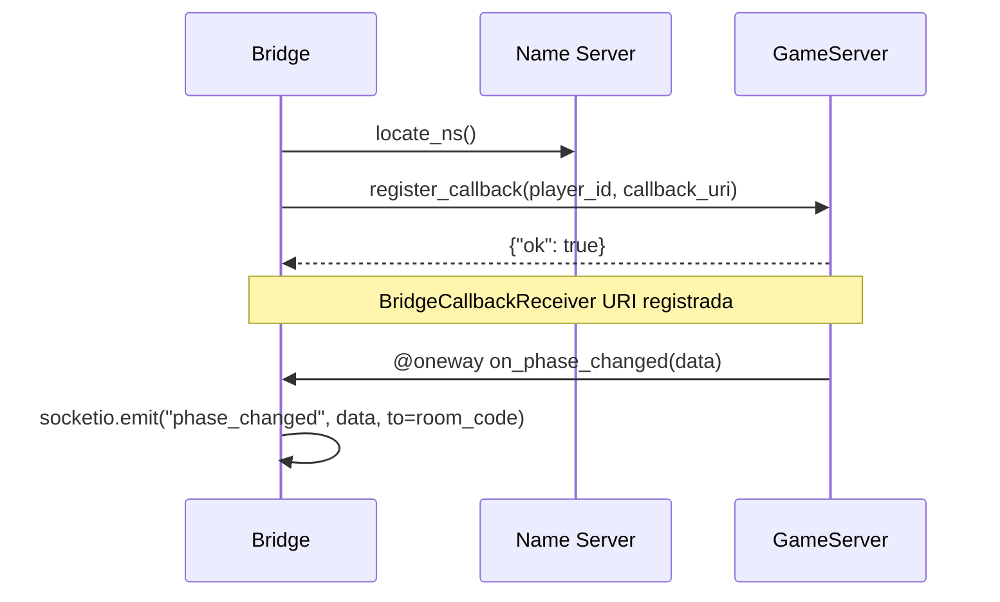

# Phase 8: UI Polish + Technical Report - Research

**Researched:** 2026-05-16
**Domain:** React/TypeScript UI component authoring + CSS animation + pandoc/LaTeX technical report
**Confidence:** HIGH

---

<user_constraints>
## User Constraints (from CONTEXT.md)

### Locked Decisions

**Relatório Técnico (REPORT)**
- D-01: Formato do relatório: Markdown + pandoc → PDF. Arquivo versionado no repositório.
- D-02: Ferramenta para diagramas: Mermaid. Diagramas em blocos Mermaid dentro do Markdown. Compilados junto com pandoc.
- D-03: Idioma: Português.
- D-04: Formatação: Formato livre, sem norma ABNT/IEEE. Template pandoc padrão com estilos profissionais.
- D-05: Extensão alvo: 5–10 páginas. Priorizar diagramas, código e capturas de tela.
- D-06: Seções obrigatórias: introdução Pyro5 + comparativo RPC; arquitetura 3 processos + ≥2 diagramas de sequência; capturas de tela + trechos de código; instruções de instalação e execução.

**UI Polish — Escopo Geral**
- D-07: Todas as telas precisam de polish: Landing, CreateGame, JoinByCode, Lobby, GameScreen, PostGame. Nível profissional/produtivo.
- D-08: Chips de dicas públicas (UI-04) já razoáveis — refinamento visual apenas.

**Modais por Fase (UI-06)**
- D-09: Criar modais/overlays para HINT, GUESS, EXCHANGE (solicitante + receptor), SPY. Nenhuma fase usa input inline.
- D-10: EXCHANGE tem dois papéis: solicitante vê status; receptor vê pedido com Aceitar/Recusar.
- D-11: SPY modal exibe lista de trocas ativas, seleciona uma, confirma risco de penalidade.

**Timer com 3 Cores (UI-05)**
- D-12: CountdownDisplay.tsx adicionar: >10s → verde (#22c55e), ≤10s → âmbar (#eab308), ≤5s → vermelho (#ef4444). CSS transition 300ms.

**Animações e Transições**
- D-13: Delta de pontos (UI-07): CSS keyframes. slideUpFade, 1.5s, verde positivo / vermelho negativo.
- D-14: Transições de fase: modal entra com slide ou fade ao receber PHASE_CHANGED.

**Banner de Reconexão (UI-09)**
- D-15: Faixa superior fixa (top sticky bar), não bloqueia conteúdo.
- D-16: Âmbar imediato → vermelho após 3s → some ao reconectar.
- D-17: Escopo: apenas no GameScreen.

### Claude's Discretion

- Biblioteca CSS para animações: CSS puro com keyframes (framer-motion está fora de escopo por D-DEFERRED).
- Duração exata das transições de fase (200ms–400ms).
- Estrutura de arquivos para o relatório (docs/ vs report/).
- Template pandoc a usar (default ou eisvogel).

### Deferred Ideas (OUT OF SCOPE)

- Modo espectador
- Histórico de partida persistente
- Internacionalização (inglês no relatório)
- Animações com framer-motion
</user_constraints>

---

<phase_requirements>
## Phase Requirements

| ID | Description | Research Support |
|----|-------------|------------------|
| UI-01 | Landing page com CTA "Criar Partida" e CTA "Entrar em Partida" | Landing.tsx existe com 133 linhas; hover states faltam; dark card precisa de polish |
| UI-02 | Tela criar partida: input apelido + seleção turnos + botão criar | CreateGame.tsx existe com 139 linhas; usa pages.css compartilhado; form alinhada |
| UI-03 | Lobby: lista jogadores em tempo real, link copiável, botão Iniciar (só host, ≥2) | Lobby.tsx 319 linhas; hover states em player list ausentes; copy feedback já tem |
| UI-04 | Tela de jogo: imagem secreta, chips de dicas, zona de ação, placar/chat | GameScreen.tsx 552 linhas; chips existem; zona de ação inline → migrar para modais |
| UI-05 | Timer visual com 3 estados de cor | CountdownDisplay.tsx 18 linhas; só cor estática; adicionar lógica de cor + transition |
| UI-06 | Modais/overlays por fase: HINT, GUESS, EXCHANGE, SPY | Nenhum modal existe; criar PhaseModal.tsx novo com 4 variantes |
| UI-07 | Painel de scoring com delta animado ao fim de cada turno | ScoringPhasePanel inline existe; criar ScoreDeltaToast.tsx com keyframes |
| UI-08 | Tela de resultados finais: pódio, tabela turno×jogador, votação ao vivo | PostGame.tsx 339 linhas; pódio e tabela existem; polish: hover em cards, row highlight |
| UI-09 | Banner de reconexão não-bloqueante (âmbar → vermelho) | Nada existe; criar ReconnectionBanner.tsx; ouvir socket connect/disconnect |
| UI-10 | Separação visual radical chat vs ações de jogo | ChatPanel.tsx implementado na fase 7; polish de label/placeholder conforme UI-SPEC |
| REPORT-01 | Introdução ao Pyro5 com comparativo RPC e justificativa | CLAUDE.md §Technology Stack §Alternatives Considered é a fonte principal |
| REPORT-02 | Arquitetura: diagrama 3 processos + ≥2 diagramas de sequência RPC | Mermaid disponível via pandoc-mermaid-filter no venv |
| REPORT-03 | Capturas de tela da aplicação + trechos de código relevantes | docker-compose.yml disponível para rodar demo; imagens inseridas como PNG no MD |
| REPORT-04 | Instruções completas de instalação e execução | start-demo.sh e docker-compose.yml existem; documentar os 3 terminais manualmente |
</phase_requirements>

---

## Summary

A fase 8 tem dois tracks paralelos: UI Polish e Relatório Técnico. No track de UI, o trabalho principal está em GameScreen.tsx — 552 linhas com todas as ações de fase como inputs inline que precisam ser migradas para modais dedicados (PhaseModal.tsx). Os outros arquivos (Landing, CreateGame, JoinByCode, Lobby, PostGame) precisam apenas de refinamento visual: hover states, foco visível, hierarquia tipográfica. Dois novos componentes são necessários: `ReconnectionBanner.tsx` (ouve socket disconnect/connect, faixa fixa no topo do GameScreen) e `ScoreDeltaToast.tsx` (animação CSS sobre o painel de pontuação). `CountdownDisplay.tsx` precisa apenas de 5 linhas de mudança: derivar cor dos `remainingSeconds` existentes e adicionar `transition: color 0.3s ease`.

No track do relatório, pandoc 2.17.1.1 está disponível em `/usr/bin/pandoc`. xelatex está disponível em `/usr/bin/xelatex` para geração de PDF. `pandoc-mermaid-filter` está instalado no venv em `/home/spacko/.../venv/bin/pandoc-mermaid`. O filtro depende de um binário `mermaid` (por padrão `mermaid` ou o que MERMAID_BIN aponta) que chama `mermaid -i file.mmd -o file.png`. A alternativa mais robusta é pre-renderizar diagramas Mermaid como SVG/PNG com `@mermaid-js/mermaid-cli` (mmdc) instalável via npm — Google Chrome 148 está disponível no sistema para headless rendering. A abordagem recomendada é: npm install `@mermaid-js/mermaid-cli` localmente no diretório `docs/`, pre-renderizar os diagramas, e inserir como imagens no Markdown.

A fonte canônica para o conteúdo do relatório é `CLAUDE.md` (stack completo, padrões Pyro5, justificativas). O comparativo de tecnologias deve mencionar Java RMI, gRPC, RPyC e justificar Pyro5 com os critérios da disciplina.

**Primary recommendation:** Implementar os dois tracks em waves separadas: Wave 1 (novos componentes: PhaseModal, ReconnectionBanner, ScoreDeltaToast + CountdownDisplay color), Wave 2 (polish CSS dos screens existentes), Wave 3 (relatório técnico + Makefile de compilação).

---

## Architectural Responsibility Map

| Capability | Primary Tier | Secondary Tier | Rationale |
|------------|-------------|----------------|-----------|
| Phase modal rendering | Browser/Client (React) | — | Estado de fase já existe em GameScreen; modal é apresentação local do estado de socket |
| Reconnection detection | Browser/Client (socket.io-client) | — | `socket.on('disconnect')` / `socket.on('connect')` são eventos do cliente; sem RPC necessário |
| Score delta animation | Browser/Client (CSS + React) | — | Dados já chegam via `score_updated` event; animação é apresentação local |
| Timer color states | Browser/Client (React + CSS) | — | `remainingSeconds` já é estado local decrementado por setInterval |
| Exchange/spy state tracking | Browser/Client (React state) | API/Backend (game_server) | Eventos `exchange_requested`, `exchange_hints`, `spy_success` chegam via socket; estado de qual troca está ativa precisa ser rastreado no cliente |
| Relatório PDF | Build pipeline (pandoc+xelatex) | — | Processo offline de compilação; não integra com runtime |

---

## Standard Stack

### Core (já instalado — sem novas dependências de runtime)

| Library | Version | Purpose | Why Standard |
|---------|---------|---------|--------------|
| React | 19.2.6 | Componentes UI | Já em uso em todo o projeto |
| TypeScript | 5.8.3 | Tipagem | Já em uso |
| Tailwind CSS | 3.4.17 (npm, não CDN) | Utilitários de estilo | Já configurado via vite/postcss |
| socket.io-client | 4.8.3 | Eventos WebSocket | Já em uso; ReconnectionBanner ouve connect/disconnect |
| CSS custom (por arquivo .css) | — | Componentes com escopo | Padrão do projeto desde fase 2 |

[VERIFIED: package.json lido diretamente]

### Build Tools (relatório técnico)

| Tool | Version | Purpose | Status |
|------|---------|---------|--------|
| pandoc | 2.17.1.1 | Markdown → PDF | Disponível em /usr/bin/pandoc |
| xelatex | TeX Live 2022 | PDF engine para pandoc | Disponível em /usr/bin/xelatex |
| @mermaid-js/mermaid-cli (mmdc) | latest | Pre-renderizar diagramas Mermaid → PNG | Precisa ser instalado localmente |

[VERIFIED: verificado via Bash no sistema]

### Alternatives Considered

| Instead of | Could Use | Tradeoff |
|------------|-----------|----------|
| xelatex engine | wkhtmltopdf | wkhtmltopdf não disponível no sistema |
| mmdc (pre-render) | pandoc-mermaid-filter | pandoc-mermaid-filter chama binário `mermaid` que não existe; mmdc + chrome disponível é mais robusto |
| CSS keyframes puro | framer-motion | framer-motion é deferred explicitamente (D-DEFERRED); CSS é suficiente para o escopo |

---

## Package Legitimacy Audit

Nenhum novo pacote de runtime será instalado. As únicas instalações são ferramentas de build:

| Package | Registry | Age | Source Repo | slopcheck | Disposition |
|---------|----------|-----|-------------|-----------|-------------|
| @mermaid-js/mermaid-cli | npm | ~7 anos | github.com/mermaid-js/mermaid | N/A — pacote oficial do projeto Mermaid | Approved |
| pandoc-mermaid-filter | PyPI | ~7 anos | github.com/timofurrer/pandoc-mermaid-filter | [ASSUMED — não executado slopcheck] | Conditional — já instalado no venv; não usar se mmdc funcionar |

[ASSUMED: slopcheck não disponível. @mermaid-js/mermaid-cli é pacote oficial do projeto open-source Mermaid (github.com/mermaid-js/mermaid-cli). A instalação é local para fins de build do relatório, não afeta runtime.]

**Packages removed due to slopcheck [SLOP] verdict:** none
**Packages flagged as suspicious [SUS]:** none

---

## Architecture Patterns

### System Architecture Diagram

```
Browser (React)
  ├── socket.io-client (connect/disconnect) ──→ ReconnectionBanner [NEW]
  ├── phase_changed event ──→ PhaseModal [NEW] (variant por fase)
  │     ├── HINT_PHASE → HINT modal (input de dica)
  │     ├── GUESS_PHASE → GUESS modal (select + input)
  │     ├── EXCHANGE_PHASE → EXCHANGE modal (requester view | recipient view)
  │     └── SPY_PHASE → SPY modal (lista completed_exchanges do spy_targets)
  ├── score_updated event ──→ ScoreDeltaToast [NEW] (keyframe slideUpFade)
  ├── exchange_requested event ──→ estado exchangeRequest no GameScreen
  ├── exchange_hints / spy_success → estado local (informação privada)
  └── CountdownDisplay [REFINE] ← remainingSeconds → cor derivada (3 estados)

Screens (CSS polish only):
  Landing.tsx, CreateGame.tsx, JoinByCode.tsx → hover states + foco
  Lobby.tsx → player list hover, copy feedback já existe
  PostGame.tsx → podium hover, table row highlight mine
  ChatPanel.tsx → label/placeholder copy per UI-SPEC (UI-10)
```

### Recommended Project Structure

```
frontend/src/
├── components/
│   ├── CountdownDisplay.tsx     # REFINE — adicionar cor
│   ├── PhaseModal.tsx           # NEW — 4 variantes de modal por fase
│   ├── ReconnectionBanner.tsx   # NEW — faixa fixa connect/disconnect
│   ├── ScoreDeltaToast.tsx      # NEW — animação delta pontos
│   ├── ChatPanel.tsx            # polish label/placeholder
│   ├── PhaseBadge.tsx           # REUSE — no header do PhaseModal
│   └── PlayerListItem.tsx       # sem mudança
├── pages/
│   ├── GameScreen.tsx           # REFACTOR — migrar inline → PhaseModal
│   ├── GameScreen.css           # EXTEND — keyframes slideInFromBottom, slideUpFade
│   ├── PostGame.tsx/css         # POLISH — podium hover, row highlight
│   ├── Landing.tsx              # POLISH — hover states feature cards
│   ├── CreateGame.tsx / JoinByCode.tsx / pages.css  # POLISH — alinhamento
│   └── Lobby.tsx                # POLISH — player list hover
└── index.css                    # ADD keyframes globais se necessário

docs/
├── relatorio.md                 # Relatório técnico em Markdown + Mermaid
├── Makefile                     # make pdf → pandoc + mmdc pipeline
├── screenshots/                 # PNGs da aplicação rodando
└── diagrams/                    # SVG/PNG pre-renderizados dos diagramas Mermaid
```

### Pattern 1: PhaseModal — Overlay + Variante por Fase

**What:** Componente único `PhaseModal.tsx` que recebe `phase` como prop e renderiza a variante correta. O overlay é posição fixa, z-index 50, fundo semitransparente. Click no backdrop NÃO fecha o modal.

**When to use:** Substituir todos os `renderPhasePanel()` cases em GameScreen.tsx que têm inputs de ação (HINT_PHASE, GUESS_PHASE, EXCHANGE_PHASE, SPY_PHASE).

**Props interface:**
```typescript
interface PhaseModalProps {
  phase: string
  players: Player[]
  myPlayerId: string
  // HINT
  hintInput: string
  onHintChange: (v: string) => void
  onHintSubmit: () => void
  hintSubmitted: boolean
  hintsCount: number
  totalPlayers: number
  // GUESS
  hints: Record<string, string>
  guessTarget: string
  onGuessTargetChange: (v: string) => void
  guessInput: string
  onGuessInputChange: (v: string) => void
  onGuessSubmit: () => void
  onGuessSkip: () => void
  guessSubmitted: boolean
  guessIsCorrect: boolean | null
  // EXCHANGE
  exchangeRequest: ExchangeRequest | null   // incoming request (recipient view)
  myExchangeId: string | null               // if requester, current exchange_id
  exchangeStatus: string | null             // 'pending'|'accepted'|'rejected'|null
  exchangeHintInput: string
  onExchangeHintChange: (v: string) => void
  onExchangeAccept: () => void
  onExchangeDecline: () => void
  onExchangeHintSubmit: () => void
  exchangeHintSubmitted: boolean
  // SPY
  spyTargets: string[]                      // list of exchange_ids (from PHASE_CHANGED)
  selectedSpyTarget: string
  onSpyTargetSelect: (id: string) => void
  onSpyAttempt: () => void
  spyAttempted: boolean
}
```

**CSS entry animation pattern:**
```css
/* Source: 08-UI-SPEC.md §Animation Keyframes */
@keyframes slideInFromBottom {
  from { opacity: 0; transform: translateY(24px); }
  to   { opacity: 1; transform: translateY(0); }
}

.phase-modal {
  animation: slideInFromBottom 250ms ease-out;
}
```

### Pattern 2: ReconnectionBanner — Fixed Top Bar

**What:** Componente `ReconnectionBanner.tsx` com estado gerenciado por `useRef` para o timer de 3s. Não usa `setInterval` — usa `setTimeout` com `useRef` para evitar acúmulo de timers.

**Integration in GameScreen.tsx:**
```typescript
// Source: 08-UI-SPEC.md §Component Inventory
const [bannerState, setBannerState] = useState<'hidden'|'amber'|'red'>('hidden')
const bannerTimerRef = useRef<ReturnType<typeof setTimeout> | null>(null)

useEffect(() => {
  const handleDisconnect = () => {
    setBannerState('amber')
    bannerTimerRef.current = setTimeout(() => setBannerState('red'), 3000)
  }
  const handleConnect = () => {
    if (bannerTimerRef.current) clearTimeout(bannerTimerRef.current)
    setBannerState('hidden')
  }
  socket.on('disconnect', handleDisconnect)
  socket.on('connect', handleConnect)
  return () => {
    socket.off('disconnect', handleDisconnect)
    socket.off('connect', handleConnect)
    if (bannerTimerRef.current) clearTimeout(bannerTimerRef.current)
  }
}, [])
```

**Layout constraint:** Quando banner visível, `game-screen` precisa de `padding-top: 40px` para não sobrepor conteúdo. Implementar com classe condicional.

### Pattern 3: ScoreDeltaToast — Animação Float-Up

**What:** Componente absolutamente posicionado sobre o painel de scoring. Montado por `SCORE_UPDATED`, removido do DOM via `onAnimationEnd`. Múltiplos toasts podem coexistir (um por jogador).

**State in GameScreen:**
```typescript
interface DeltaToast {
  id: string
  playerName: string
  delta: number
}
const [deltaToasts, setDeltaToasts] = useState<DeltaToast[]>([])

// On SCORE_UPDATED:
const handleScoreUpdated = (data: ScoreUpdatedPayload) => {
  setScores(data.scores)
  const newToasts = data.scores
    .filter(s => s.turn_delta !== 0)
    .map(s => ({ id: `${s.player_id}-${Date.now()}`, playerName: s.player_name, delta: s.turn_delta }))
  setDeltaToasts(prev => [...prev, ...newToasts])
}

// Remove on animation end:
const removeToast = (id: string) => setDeltaToasts(prev => prev.filter(t => t.id !== id))
```

**CSS:**
```css
/* Source: 08-UI-SPEC.md §Animation Keyframes */
@keyframes slideUpFade {
  0%   { opacity: 1; transform: translateY(0); }
  70%  { opacity: 1; transform: translateY(-24px); }
  100% { opacity: 0; transform: translateY(-32px); }
}
.score-delta-toast {
  position: absolute;
  animation: slideUpFade 1.5s ease-out forwards;
  font-size: 20px;
  font-weight: 600;
  pointer-events: none;
}
```

### Pattern 4: CountdownDisplay Color Derivation

**What:** Mudança mínima — derivar cor inline dos `remainingSeconds` existentes.

```typescript
// Source: 08-UI-SPEC.md §Color §Timer color contract
function timerColor(seconds: number): string {
  if (seconds <= 5) return '#ef4444'
  if (seconds <= 10) return '#eab308'
  return '#22c55e'
}

export default function CountdownDisplay({ seconds }: CountdownDisplayProps) {
  return (
    <span
      style={{
        fontSize: '28px',
        fontWeight: 600,
        color: timerColor(seconds),
        transition: 'color 0.3s ease',
      }}
      aria-live="polite"
    >
      {seconds}s
    </span>
  )
}
```

### Pattern 5: Exchange/SPY State Tracking no GameScreen

O GameScreen precisa rastrear estado de troca entre eventos socket. Os eventos relevantes e seus payloads são:

| Evento | Direção | Payload relevante |
|--------|---------|------------------|
| `exchange_requested` | server → receptor | `{ exchange_id, requester_id, target_player_id, room_code }` |
| `respond_exchange` (emit) | cliente → server | `{ exchange_id, accept: bool }` |
| `submit_exchange_hint` (emit) | cliente → server | `{ exchange_id, hint_word }` |
| `exchange_hints` | server → participante | `{ target_player_id, exchange_id, hints: [{from_player_id, hint_word}, ...] }` |
| `attempt_spy` (emit) | cliente → server | `{ exchange_id }` |
| `spy_success` | server → espião | `{ target_player_id, exchange_id, hints: [{...}], ... }` |
| `spy_discovered` | server → todos | `{ spy_name, exchange_id, penalty: -10, room_code }` |
| `request_exchange` (emit) | cliente → server | `{ target_player_id }` → callback `{ ok, exchange_id }` |

**State necessário em GameScreen para suportar PhaseModal:**
```typescript
interface ExchangeRequest {
  exchange_id: string
  requester_id: string
}

// Adicionar ao estado de GameScreen:
const [exchangeRequest, setExchangeRequest] = useState<ExchangeRequest | null>(null)
const [myExchangeId, setMyExchangeId] = useState<string | null>(null)
const [exchangeStatus, setExchangeStatus] = useState<string | null>(null)
const [exchangeHintInput, setExchangeHintInput] = useState('')
const [exchangeHintSubmitted, setExchangeHintSubmitted] = useState(false)
const [selectedSpyTarget, setSelectedSpyTarget] = useState('')
const [spyTargets, setSpyTargets] = useState<string[]>([])
const [spyAttempted, setSpyAttempted] = useState(false)
```

`spy_targets` chega no payload de `phase_changed` quando a fase é `SPY_PHASE` — já está no servidor (turn_machine.py:207).

**Reset on HINT_PHASE** (já feito para hint/guess): adicionar reset do estado de exchange/spy na mesma branch `if (data.phase === 'HINT_PHASE')`.

### Pattern 6: Relatório Técnico — Compilação pandoc

**Workflow de compilação:**
```bash
# Pré-requisito: instalar mmdc localmente
cd docs && npm install @mermaid-js/mermaid-cli

# Pre-renderizar diagramas
./node_modules/.bin/mmdc -i diagrams/arquitetura.mmd -o diagrams/arquitetura.png -b transparent
./node_modules/.bin/mmdc -i diagrams/seq-callback.mmd -o diagrams/seq-callback.png -b transparent
./node_modules/.bin/mmdc -i diagrams/seq-game-event.mmd -o diagrams/seq-game-event.png -b transparent

# Compilar Markdown → PDF via pandoc + xelatex
pandoc relatorio.md \
  -o relatorio.pdf \
  --pdf-engine=xelatex \
  -V geometry:margin=2cm \
  -V fontsize=11pt \
  -V lang=pt-BR \
  --highlight-style=tango
```

**Rationale:** `pandoc-mermaid-filter` está instalado no venv mas requer um binário `mermaid` (não `mmdc`). Configurar `MERMAID_BIN=path/to/mmdc` é possível, mas mais frágil. Pre-renderizar explicitamente é mais simples e reproduzível.

### Anti-Patterns to Avoid

- **Compartilhar estado de modal por contexto React global:** O GameScreen é o único consumidor — passar props diretamente evita overhead desnecessário.
- **Usar `useEffect` para animar toasts com `setTimeout` em vez de `onAnimationEnd`:** `onAnimationEnd` é declarativo e não deixa leaks.
- **Chamar `socket.emit` dentro do render:** Sempre dentro de handlers (onClick, useEffect).
- **Usar `React.createPortal` para o modal:** Não necessário — o `position: fixed` do overlay já escapa do fluxo do DOM. Portal adicionaria complexidade sem benefício.
- **Colocar keyframes em `<style>` inline (como Lobby.tsx faz para fadeIn):** Adicionar os keyframes ao `GameScreen.css` ou `index.css` para manutenibilidade.

---

## Don't Hand-Roll

| Problem | Don't Build | Use Instead | Why |
|---------|-------------|-------------|-----|
| Mermaid diagram rendering | Parser Mermaid manual | mmdc (@mermaid-js/mermaid-cli) | mmdc é o CLI oficial; suporta todos os tipos de diagrama |
| Scroll-to-bottom no chat | lógica customizada | Padrão já em ChatPanel.tsx com userScrolledRef | Já implementado e testado na fase 7 |
| Clipboard copy | execCommand deprecated | navigator.clipboard.writeText() | Já usado em Lobby.tsx; reutilizar em qualquer novo botão de cópia |
| Animação de entrada modal | Framer Motion | CSS @keyframes + animation property | Framer-motion deferred; CSS puro é suficiente e não requer instalação |
| Toast auto-remove | setTimeout + clearTimeout | onAnimationEnd callback | Mais simples, sem race condition com desmontagem |

---

## Common Pitfalls

### Pitfall 1: PhaseModal fecha inesperadamente ao trocar de fase
**What goes wrong:** O modal é desmontado/remontado ao mudar fase, perdendo o estado do input no meio da digitação.
**Why it happens:** Se `key` do modal for a fase, React remonta o componente a cada `PHASE_CHANGED`.
**How to avoid:** Não usar `key={currentPhase}` no PhaseModal. Deixar o componente persistir e atualizar internamente via props. O reset de inputs deve ser via `useEffect` que observa a mudança de fase.
**Warning signs:** Input limpa sozinho ao receber evento de rede; log de "new component mounted" duplo.

### Pitfall 2: Banner de reconexão acumula timers
**What goes wrong:** Múltiplos `setTimeout` são agendados se o socket desconectar/reconectar rapidamente, causando transição amber→red depois que já reconectou.
**Why it happens:** Cada evento `disconnect` cria um novo timer sem cancelar o anterior.
**How to avoid:** Usar `useRef` para guardar o timer; sempre `clearTimeout(bannerTimerRef.current)` antes de criar novo timer (tanto no `handleDisconnect` quanto no `handleConnect`).
**Warning signs:** Banner mostra "Offline" mesmo estando conectado.

### Pitfall 3: EXCHANGE_PHASE — confusão entre papel de solicitante e receptor
**What goes wrong:** O jogador que *solicitou* a troca vê a UI de receptor (pedido de aceite) ou vice-versa.
**Why it happens:** A distinção entre "eu sou o requester" vs "eu sou o target" é implícita: se `exchange_requested` chegou para mim, sou receptor; se eu emiti `request_exchange` e obtive `exchange_id` no callback, sou solicitante.
**How to avoid:** Usar `myExchangeId !== null` como flag de "sou o solicitante". Limpar `exchangeRequest` quando aceitar/recusar. Limpar `myExchangeId` ao resetar na HINT_PHASE.
**Warning signs:** Jogador vê dois modais sobrepostos ou nenhum quando deveria ver um.

### Pitfall 4: SPY modal sem exchange_ids para exibir
**What goes wrong:** SPY modal mostra "Nenhuma troca ativa" mesmo tendo trocas completadas.
**Why it happens:** `spy_targets` só chega no payload de `PHASE_CHANGED` quando `phase === 'SPY_PHASE'`. Se o estado local não for persistido, a lista some.
**How to avoid:** Salvar `data.spy_targets` em `useState` (não apenas ler do evento). O `applyPhase` já reseta vários estados na HINT_PHASE — adicionar reset de `spyTargets` lá também.
**Warning signs:** SPY_PHASE renderizada sem nenhum exchange_id mesmo que trocas tenham ocorrido.

### Pitfall 5: pandoc + xelatex falha silenciosamente com caracteres especiais
**What goes wrong:** PDF gerado tem `□` ou falha com `LaTeX Error: Unicode char` para caracteres acentuados.
**Why it happens:** O engine pdflatex tem suporte limitado a UTF-8; xelatex suporta nativamente.
**How to avoid:** Sempre usar `--pdf-engine=xelatex` e `-V lang=pt-BR`. Adicionar `\usepackage{fontspec}` via template se necessário.
**Warning signs:** Saída do pandoc com warnings sobre `inputenc`.

### Pitfall 6: mmdc falha por falta de Puppeteer ou sandbox
**What goes wrong:** `mmdc` falha com "Error: Failed to launch the browser process!" ou sandbox error.
**Why it happens:** Puppeteer (usado pelo mmdc) precisa do Chrome e às vezes de `--no-sandbox` em ambientes Linux sem display.
**How to avoid:** Passar configuração puppeteer via arquivo `puppeteer-config.json` com `{ "args": ["--no-sandbox", "--disable-setuid-sandbox"] }` e chamar `mmdc --puppeteerConfigFile puppeteer-config.json`.
**Warning signs:** Processo mmdc termina imediatamente com erro de spawn.

---

## Code Examples

### Derivar cor do timer (CountdownDisplay.tsx)
```typescript
// Source: 08-UI-SPEC.md §Color §Timer color contract
function timerColor(seconds: number): string {
  if (seconds <= 5) return '#ef4444'
  if (seconds <= 10) return '#eab308'
  return '#22c55e'
}
// Aplicar em style={{ color: timerColor(seconds), transition: 'color 0.3s ease' }}
```

### Keyframes CSS para modal e delta
```css
/* Source: 08-UI-SPEC.md §Animation Keyframes */
@keyframes slideInFromBottom {
  from { opacity: 0; transform: translateY(24px); }
  to   { opacity: 1; transform: translateY(0); }
}
@keyframes slideUpFade {
  0%   { opacity: 1; transform: translateY(0); }
  70%  { opacity: 1; transform: translateY(-24px); }
  100% { opacity: 0; transform: translateY(-32px); }
}
```

### Overlay do PhaseModal (CSS)
```css
/* Source: 08-UI-SPEC.md §Component Inventory §PhaseModal */
.phase-modal-overlay {
  position: fixed;
  inset: 0;
  background: rgba(0,0,0,0.7);
  z-index: 50;
  display: flex;
  align-items: center;
  justify-content: center;
}
.phase-modal-surface {
  background-color: #1a1d27;
  border-radius: 12px;
  padding: 24px;
  max-width: 480px;
  width: 100%;
  margin: 0 auto;
  animation: slideInFromBottom 250ms ease-out;
}
```

### Reconnection banner CSS
```css
/* Source: 08-UI-SPEC.md §Component Inventory §ReconnectionBanner */
.reconnection-banner {
  position: fixed;
  top: 0; left: 0; right: 0;
  z-index: 100;
  min-height: 40px;
  padding: 8px 16px;
  display: flex;
  align-items: center;
  justify-content: center;
  font-size: 14px;
  font-weight: 600;
  transition: background-color 0.5s ease;
}
.reconnection-banner--amber {
  background-color: #92400e;
  color: #fef3c7;
}
.reconnection-banner--red {
  background-color: #7f1d1d;
  color: #fee2e2;
}
```

### Estrutura Mermaid do relatório — Diagrama de Arquitetura
```mermaid
graph LR
  NS[Name Server\nPyro5 NS] 
  GS[GameServer\nPyro5 Daemon]
  BR[Bridge\nFlask-SocketIO]
  FE[Frontend\nReact Browser]
  
  GS -->|register| NS
  BR -->|lookup game.server| NS
  BR -->|RPC calls| GS
  GS -->|@oneway callback| BR
  FE -->|Socket.IO| BR
  BR -->|Socket.IO events| FE
```

### Estrutura Mermaid — Sequência de registro de callback


---

## State of the Art

| Old Approach | Current Approach | Impact |
|--------------|------------------|--------|
| Inputs inline por fase em GameScreen | Modais/overlays dedicados por fase (UI-06) | Separação clara de contexto, sem confusão entre fases |
| Timer sem cor (static #f1f5f9) | 3 estados de cor com CSS transition | Urgência visual sem poluição de texto |
| pandoc + mermaid-filter chamando `mermaid` CLI | Pre-render com mmdc, inserir PNG | Mais robusto, independe de MERMAID_BIN setup |

**Deprecated/outdated:**
- `renderPhasePanel()` com switch inline no GameScreen: substituído por PhaseModal com variantes.
- `placeholder="Mensagem de chat…"` no ChatPanel: mudar para `"Mensagem..."` per UI-SPEC.
- `Mensagem de chat` como `chat-panel__label-text`: mudar para `Chat` como heading per UI-SPEC.
- `Enviar mensagem` já está correto no ChatPanel — não mudar.

---

## Assumptions Log

| # | Claim | Section | Risk if Wrong |
|---|-------|---------|---------------|
| A1 | @mermaid-js/mermaid-cli funciona com Google Chrome 148 disponível no sistema sem necessidade de puppeteer separado | Standard Stack / Pattern 6 | Se mmdc falhar, fallback: pre-renderizar diagramas manualmente com editor online e salvar PNG |
| A2 | pandoc-mermaid-filter instalado no venv pode ser usado via `MERMAID_BIN=mmdc` como alternativa ao approach de pre-render | Common Pitfalls | Risco baixo — apenas um caminho alternativo, não o principal |
| A3 | `spy_targets` no payload de PHASE_CHANGED contém os `exchange_id`s suficientes para listar as trocas no SPY modal (sem precisar de nomes dos participantes) | Pattern 5 | Se o modal precisar de nomes, precisará buscar do estado `players` via `turns_state.exchanges[exchange_id]` — mas isso não está exposto via RPC para o cliente |

---

## Open Questions

1. **SPY modal: exibir nomes dos participantes da troca?**
   - What we know: `spy_targets` é uma lista de `exchange_id` strings opacas (turn_machine.py:207). O cliente não tem `exchanges` dict com `requester_id`/`target_id`.
   - What's unclear: O UI-SPEC diz "lista de trocas ativas" — se o servidor não envia quem são os participantes, o modal só pode mostrar "Troca #1", "Troca #2".
   - Recommendation: No SPY_PHASE PHASE_CHANGED, o servidor poderia incluir `spy_target_info: [{exchange_id, requester_name, target_name}]`. Se não for alterado o servidor, o modal mostra IDs abreviados. O planner deve decidir se alterar o broadcast ou aceitar UI degradada.

2. **Pandoc template: default vs eisvogel?**
   - What we know: eisvogel produz PDFs mais bonitos mas requer download separado do template `.tex`.
   - What's unclear: Se o template eisvogel está disponível no sistema.
   - Recommendation: Usar pandoc padrão com opções de `geometry` e `fontsize` via `-V`. Suficiente para 5-10 páginas acadêmicas.

---

## Environment Availability

| Dependency | Required By | Available | Version | Fallback |
|------------|------------|-----------|---------|----------|
| pandoc | REPORT-01 a REPORT-04 | ✓ | 2.17.1.1 | — |
| xelatex | PDF engine para pandoc | ✓ | TeX Live 2022 | pdflatex (mas com risco de encoding) |
| google-chrome | mmdc headless rendering | ✓ | 148.0.7778.167 | Pre-renderizar diagramas online |
| @mermaid-js/mermaid-cli (mmdc) | Pre-render diagramas Mermaid | ✗ (não instalado) | — | pandoc-mermaid-filter + MERMAID_BIN |
| npm | Instalar mmdc | ✓ | 10.9.3 | — |
| node | mmdc runtime | ✓ | 22.18.0 | — |

**Missing dependencies with no fallback:**
- Nenhuma dependência bloqueia completamente — todos têm fallback.

**Missing dependencies with fallback:**
- mmdc: instalar via `npm install @mermaid-js/mermaid-cli` no diretório `docs/`. O planner deve incluir um task de instalação no Wave do relatório.

---

## Validation Architecture

> nyquist_validation: não verificado em .planning/config.json — tratar como habilitado.

### Test Framework
| Property | Value |
|----------|-------|
| Framework | pytest (backend) — frontend sem framework de teste configurado |
| Config file | pytest.ini (raiz do projeto) |
| Quick run command | `python -m pytest tests/ -x -q` |
| Full suite command | `python -m pytest tests/ -v` |

### Phase Requirements → Test Map

| Req ID | Behavior | Test Type | Automated Command | File Exists? |
|--------|----------|-----------|-------------------|-------------|
| UI-01 a UI-10 | Visual polish, componentes React | Manual (visual) | n/a — sem framework de teste frontend | N/A |
| REPORT-01 a REPORT-04 | Relatório PDF compilado corretamente | Build smoke test | `make -C docs pdf && test -f docs/relatorio.pdf` | ❌ Wave 0 |

**Rationale:** O projeto não tem configuração de teste frontend (sem Jest, Vitest, RTL). Testes de UI são validação visual manual. O único teste automatizável é verificar que o Makefile produz um PDF sem erros.

### Wave 0 Gaps
- [ ] `docs/Makefile` — target `pdf` que compila o relatório; target `clean` que remove build artifacts

*(Testes de backend existentes cobrem a lógica do servidor e não precisam ser modificados por esta fase.)*

---

## Security Domain

> security_enforcement: não especificado — tratado como habilitado.

### Applicable ASVS Categories

| ASVS Category | Applies | Standard Control |
|---------------|---------|-----------------|
| V2 Authentication | não | sem autenticação nesta fase |
| V3 Session Management | não | sem mudanças em sessão |
| V4 Access Control | não | sem mudanças em endpoints |
| V5 Input Validation | sim — inputs nos modais | maxLength nos campos de texto; validação de "uma palavra" no HINT modal (sem espaços) |
| V6 Cryptography | não | sem mudanças criptográficas |

### Known Threat Patterns

| Pattern | STRIDE | Standard Mitigation |
|---------|--------|---------------------|
| Hint com múltiplas palavras | Tampering | Validar `!/\s/.test(hintInput)` no cliente antes de submit; servidor já valida com maxLength |
| Chat XSS via mensagens | Tampering | React sanitiza automaticamente via JSX; não usar `dangerouslySetInnerHTML` |
| Relatório com dados sensíveis | Information Disclosure | Relatório não contém credenciais; docker-compose usa senhas exemplo apenas |

---

## Sources

### Primary (HIGH confidence)
- Código-fonte verificado diretamente: `GameScreen.tsx`, `CountdownDisplay.tsx`, `ChatPanel.tsx`, `ChatPanel.css`, `GameScreen.css`, `index.css`, `pages.css`, `Lobby.tsx`, `PostGame.tsx`, `Landing.tsx`, `CreateGame.tsx`, `JoinByCode.tsx`, `PhaseBadge.tsx`
- `server/turn_machine.py` linhas 197–221 — spy_targets no payload PHASE_CHANGED
- `server/turn_state.py` — ExchangeRecord shape
- `server/game_server.py` linhas 716–724, 910–932 — payloads de exchange e spy
- `bridge/bridge.py` linhas 172–236 — eventos exchange_requested, exchange_hints, spy_discovered, spy_success
- `08-CONTEXT.md` — decisões locked D-01 a D-17
- `08-UI-SPEC.md` — design contract verificado completamente
- `frontend/package.json` — dependências instaladas
- Bash: `pandoc --version`, `xelatex --version`, `google-chrome --version`, `node --version`, `npm --version`

### Secondary (MEDIUM confidence)
- `pandoc-mermaid-filter` source lido em `/home/spacko/.../venv/lib/.../pandoc_mermaid_filter.py` — confirma dependência de binário `mermaid` (não `mmdc`); configurável via `MERMAID_BIN`

### Tertiary (LOW confidence)
- Comportamento de mmdc com Puppeteer + Chrome no sistema Linux [ASSUMED] — não testado; baseado em conhecimento geral do mermaid-cli

---

## Metadata

**Confidence breakdown:**
- Standard Stack: HIGH — package.json e tools verificados via Bash
- Architecture / component patterns: HIGH — código-fonte lido diretamente
- Exchange/SPY state tracking: HIGH — bridge.py e game_server.py lidos, payloads verificados
- Relatório / pandoc pipeline: MEDIUM — pandoc e xelatex verificados; mmdc + puppeteer não testado end-to-end
- Pitfalls: HIGH — derivados diretamente da estrutura do código existente

**Research date:** 2026-05-16
**Valid until:** 2026-06-16 (dependências estáveis; mmdc assume compatibilidade de Chrome 148+)
